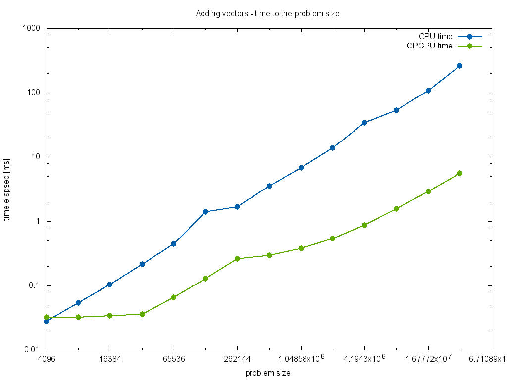
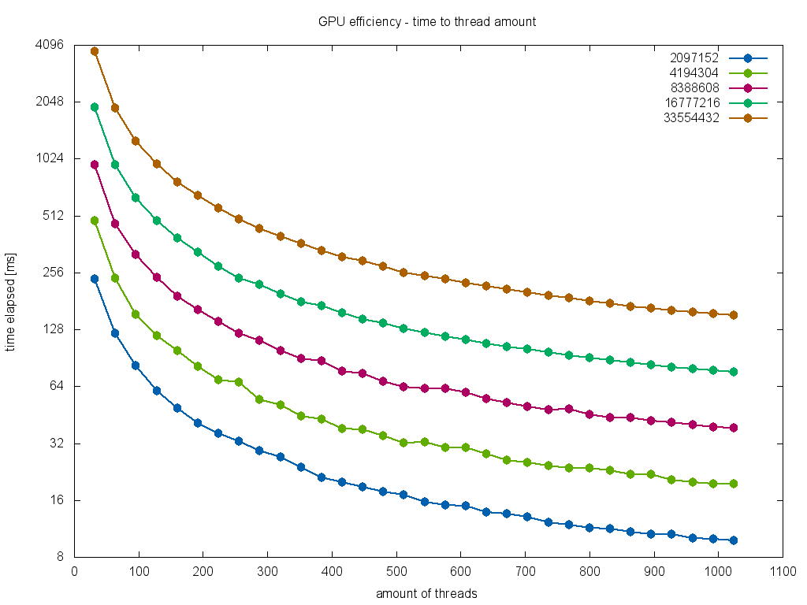

# GPGPU 1

Wyniki działania programu dodającego wektory.

## Implementacja

Program porównuje wydajność obliczeń na CPU (jeden rdzeń) z obliczeniami na GPGPU z pomocą technologii CUDA.

Argumenty wejściowe programu:

* N - wielkość problemu
* [block_size] - ilość wątków w bloku
* [grid_size] - ilość bloków w gridzie

Domyślną wartością dla `block_size` jest 1024, natomiast `grid_size` jest obliczany tak, by ogólna liczba
wątków była wystarczająca do obliczenia całego problemu. Jeżeli nie jest to możliwe (problem jest zbyt duży),
`grid_size` jest ograniczony do 65535.

Jeżeli wybrana przez użytkownika liczba wątków (równa `block_size * grid_size`) jest zbyt mała, program wykonuje
obliczenia na GPGPU kilkukrotnie tak, by suma wektorów została obliczona poprawnie.

## Porównanie czasu CPU do GPGPU

Na wykresie przedstawiona jest zależność czasu wykonania programu od wielkości problemu. Jedna seria danych przedstawiona
czas na CPU, a druga na GPGPU.

Dla osi X zastosowano skalę log(2), natomiast dla osi Y - log(10).

## Wydajność na GPGPU w zależności od liczby wątków

Wykres przedstawia zależność czasu wykonania od liczby wątków na GPGPU. Liczba wątków modyfikowana jest przez zmianę
parametru `block_size`. Parametr `grid_size` ustawiony jest na 1.

Serie danych przedstawiają wyniki dla różnych wielkości problemu.
